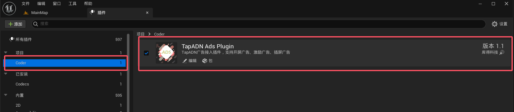

# Taptap4UEPlugin
## 重要提示：

TapADN 是中国 Taptap 公司的广告联盟平台。此插件封装了 Android 原生接口以使用 TapADN 的广告接入服务。如果游戏在中国大陆以外发布，请勿购买此插件。

此插件仅支持 Android 手机游戏，并已在 Android 手机上进行了测试，但尚未在 Android 平板上进行测试。

## 指导服务：

如果在使用过程中遇到任何问题，请联系作者获取技术支持。QQ 群：325079080

目前支持 TapADN 的开屏广告、激励广告和插屏广告。

只需在蓝图上调用 Taptap 广告子系统，即可轻松使用封装的广告接入服务。

目前仅与 UE5.4 和 UE5.5 版本兼容。

## 使用方法：

1. 安装插件后，进入 UE，打开插件面板，在 Coder 类别下找到 TapTapAD 插件并启用它。需要注意的是，启用插件后需要重新启动UE方可生效。

2. 打开项目设置，在左侧的“插件”类别下找到“TapTap 广告设置”，在此可以配置 TapTap 广告接口。此处配置的信息来自 TapTapAD 官方网站。请申请一个 TapTap 账户并自行设置相关信息。

3. 加载广告。打开任意蓝图，右键单击，搜索“获取 taptap”，选择“获取 TaptapAdSubsystem”，然后使用 TaptapAdSubsystem 对象搜索“加载”，选择要加载的广告类型。目前支持三种形式的广告：开屏广告、激励广告和插屏广告。使用非常简单。

监控广告回调。从 TaptapAdSubsystem 对象拖放，搜索“绑定到”以查看三种广告类型支持的所有回调，并将事件绑定到它。

插件实现语言：100% C++和 Java

## 温馨提示：

需要您在UE中，打包 Android 开发包或分发包，再传到 Android 手机上进行真机测试。在 UE 窗口或独立窗口模式下运行将无法正常工作。

创建发布包时，需要在“项目设置 - 插件 - Android 文件服务器”的“包”列下选中“包含在发布版本中”选项。否则，无法正常打包分发包。
