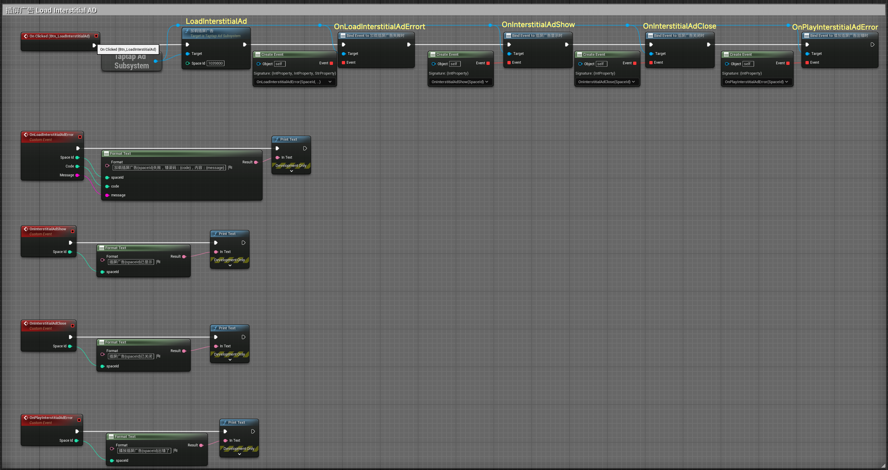
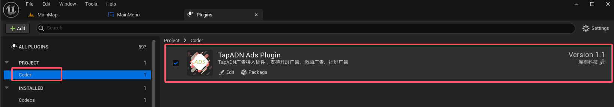
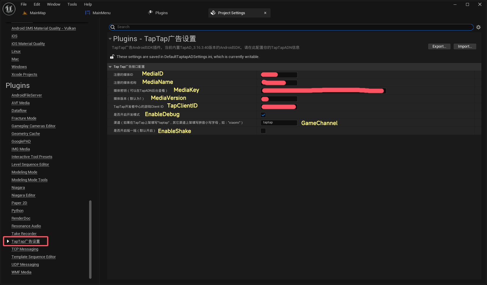
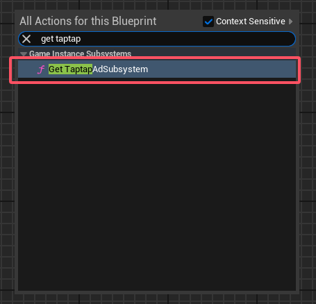
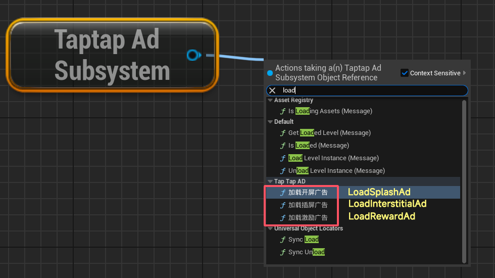
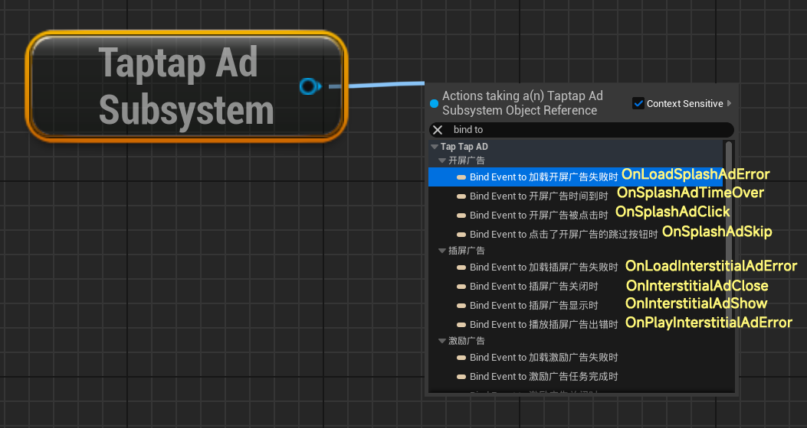
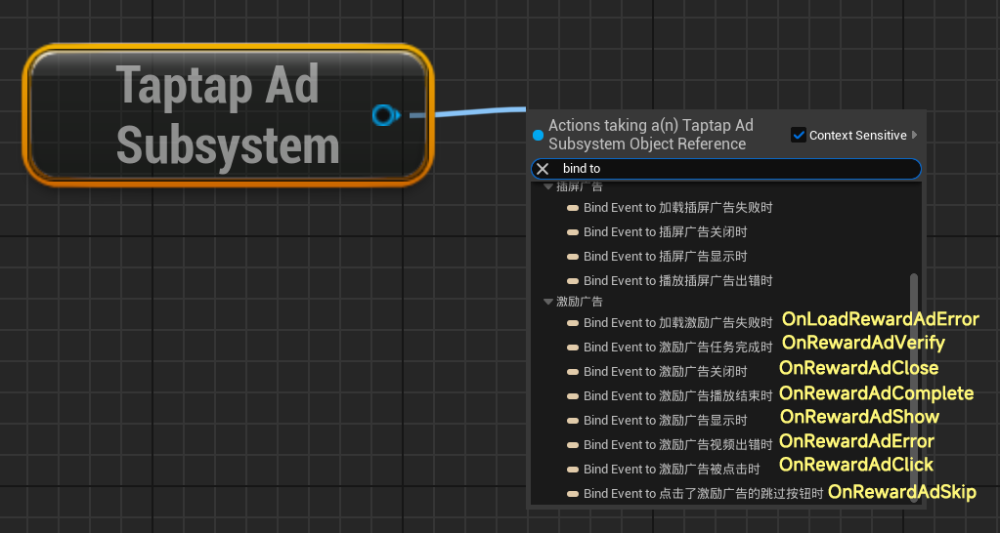
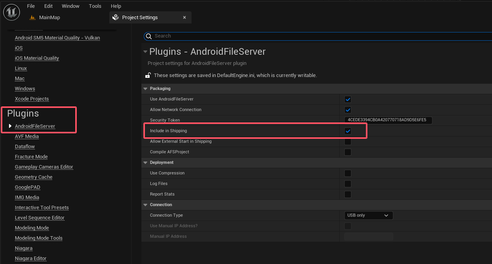

English <a href="README.md">中文</a>

# Taptap4UEPlugin
## IMPORTANT NOTE:

TapADN is the advertising alliance platform of Chinese Taptap company. This plugin encapsulates the Android native interface to use TapADN's advertising access service. If the game is released outside of China, it maybe disable to access the AD server properly.It might not be for you!

This plugin only supports Android mobile games and has been tested on Android phones, but has not been tested on Android Pad.

## GUIDANCE SERVICES:

If you encounter any problems during use, please contact the author for technical support. QQ Group：325079080

Currently supports TapADN's open screen ads, incentive ads, and interstitial ads.
Just call Taptap Ad Subsystem in the blueprint, and you can easily use the encapsulated advertising access service.

At present, it is only compatible with UE5.4 and UE5.5 version.

## Sample Graph
Here is a example of an interstitial AD as below:

## SETUP：

1. After installing the plugin, enter UE, open the plugin panel, find the TapTapAD Plugin under the Coder category, and enable it.

2. Open the project settings and find "TapTap Advertising Settings" under the "Plugin" category on the left, where you can configure the TapTap advertising interface. The information configured here comes from the TapTapAD official website. Please apply for a TapTap account and set up the relevant information yourself.

3. For Load advertisement. Open any blueprint you want, right-click, search for "get taptap", select "get TaptapAdSubsystem".

4. And then use the TaptapAdSubsystem object to search for "load" and select which type of advertisement to load. Currently, it supports three forms of advertising: open screen advertising, incentive advertising, and interstitial advertising. The usage is very simple.For an introduction to these three types of advertising formats, please refer to the TapADN official documentation.

All three Ads type as above,you need to pass in the "Space ID" that you can find it in the TapADN official Webside. 

5. Monitor ad callbacks. Drag and drop from the TaptapAdSubsystem object, search for "bind to" to view all supported callbacks for the three types of advertisements, and bind the event to it.

### Plugin implementation languages: 100% C++and Java

## ANNOUNCEMENTS:

### It is necessary to package the Android development package or distribution package onto an Android phone for real machine testing. Running it in UE window or standalone window mode will not work.

### When you creating a release package, you need to check the "Include in Shipping" option under the "Package" column in "Project Settings - Plugin - AndroidFileServer". Otherwise, it cannot be fully packaged into the distribution version.

